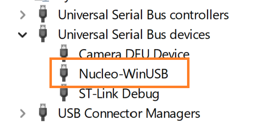

# Nucleo_WinUSB
This project demonstrates how to configure the USB peripheral of a Nucleo-H563ZI EVB to have MS-Windows recognize it as a WinUSB device.


## Notes
- The Windows PC can be connected to either the virtual COM port (CN1) or the user USB Type-C connector (CN13).  
- Either connection allows to control the Nucleo_WinUSB GPIOs.
- If used through the virtual COM port (CN1), a user can control the GPIO by entering appropriate commands in a CLI via the virtual COM with baudrate=115000bps, Data bits = 8, Stop bit = 1, Parity = none, Flow Control = none.  
- If used through the user USB connector (CN13), the an application software must use the Nucleo_WinUSB.dll to control the GPIOs of the Nucleo_WinUSB.
- The Nucleo board is powered from the ST-Link USB connector (CN1) by default, but it can also be powered from the user USB connector (CN13) by fitting JP2 on pins 9 and 10. 
In case the Nucleo_WinUSB is to be controlled through the user USB connector (CN13) and its DLL, once the Nucleo_WinUSB.bin firmware has been programmed into the MCU through the ST-Link USB connector (CN1), and after changing the JP2 to 9-10 pins, only the user USB connection (CN13) is needed.


As soon as the user USB is plugged into Windows PC, Windows will recognize it as a WinUSB device and automatically load the WinUSB driver:

"

## Directory structure:

```plaintext
Root folder
    │
    ├── LICENSE.md --> License description.
    │
    ├── README.md --> this file.
    │
    ├── Core/ --> firmware source and header files.
    │
    ├── DLL/ --> Dynamic Linked Library to access the Nucleo_WinUSB via USB.
    │    │
    │    ├── doc/ --> DLL doxygen documentation. Start with index.html.
    │    │
    │    ├── Nucleo_WinUSB.h --> DLL header file.
    │    │
    │    ├── Nucleo_WinUSB.sln --> Visual Studio solution that includes both DLL project and Nucleo_WinUSB_Test project.
    │    │
    │    └── x64/Debug/
    │              │
    │              ├── Nucleo_WinUSB.dll --> DLL file to be referenced by programs using the DLL.
    │              │
    │              └── Nucleo_WinUSB_Test.exe --> CLI test tool to control the Nucleo_WinUSB board through its DLL.
    │             
    │ 
    ├── Drivers/ --> STM32 Low Level sources and headers.
    │
    ├── ioc/ --> settings for STM32CubeMX generator.
    │
    ├── .project  --> STM32CubeIDE project.
    │
    ├── Nucleo_WinUSB.launch --> settings for ST-Link GDB Server. Used to debug the Nucleo_WinUSB firmware via ST_Link.
    │
    └── STM32H563xx_FLASH.ld --> Nucleo_WinUSB firmware linker script.
```	

## Build tools:
The Nucleo_WinUSB firmware can only be build inside the STM32CubeIDE. The IDE automatically generates the makefiles at every compile.
The latest binaries can be found in the Debug/ folder.
The DLL code was developed with Microsoft Visual Studio. The .dll file is in DLL/x64/Debug.

